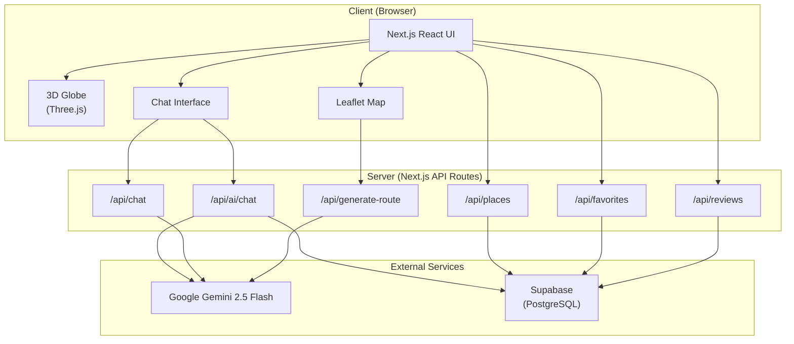
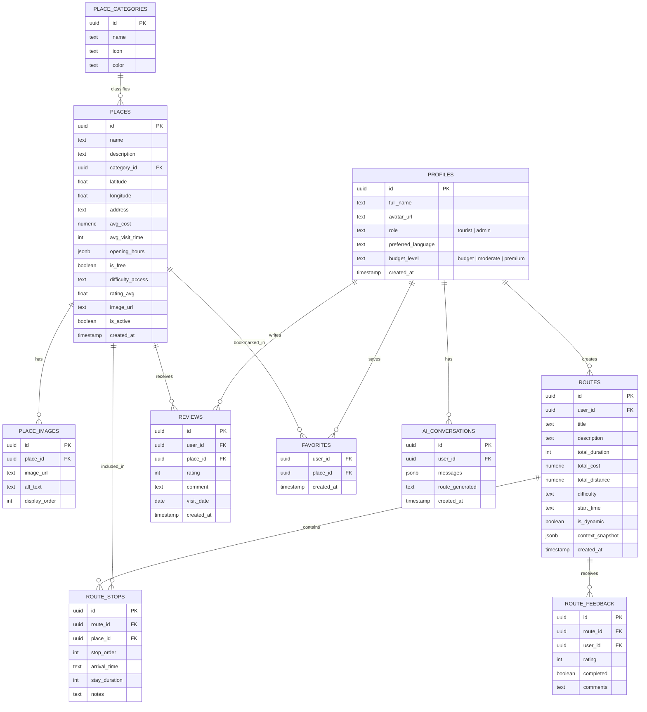
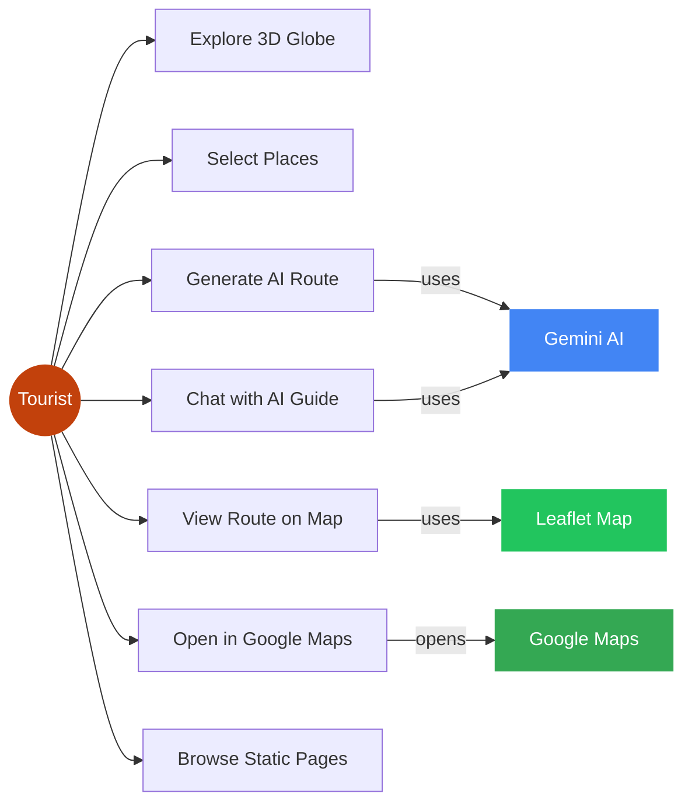
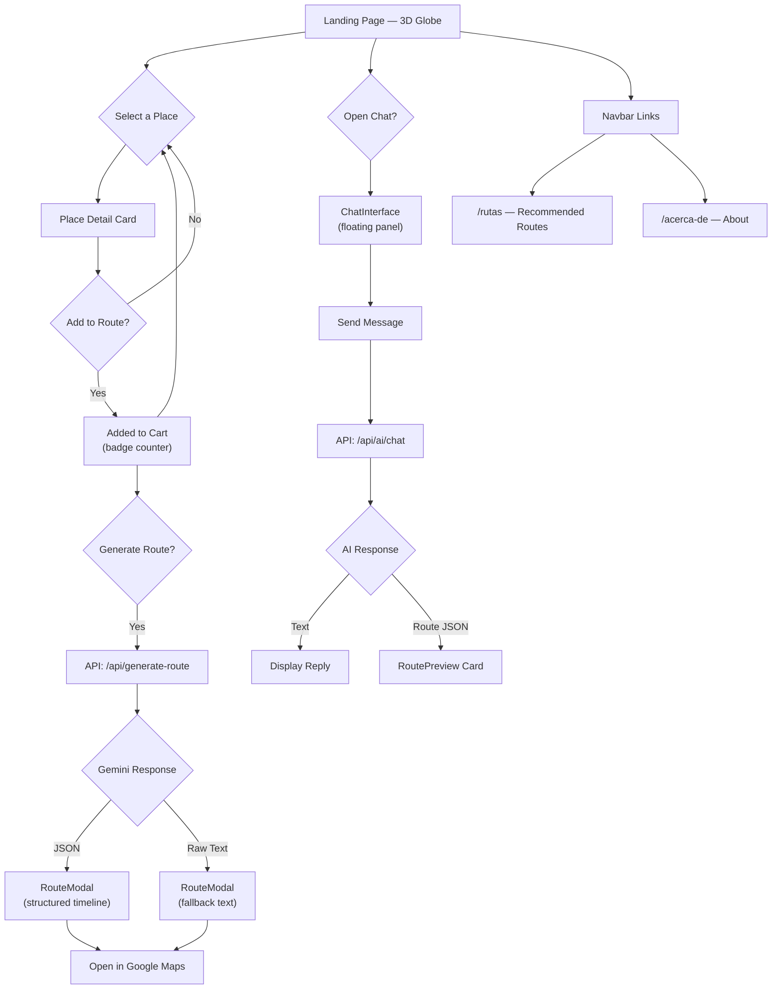

# SmartTour — Intelligent Tourism Platform

> Interactive web platform for exploring Sucre, Bolivia — a UNESCO World Heritage City — through AI-powered route generation, a 3D interactive globe, and a virtual tourism assistant.

---

## Table of Contents

- [Overview](#overview)
- [Key Features](#key-features)
- [System Architecture](#system-architecture)
- [Diagrams](#diagrams)
- [Project Structure](#project-structure)
- [Environment Variables](#environment-variables)
- [Getting Started](#getting-started)
- [Tech Stack](#tech-stack)

---

## Overview

SmartTour is a full-stack web application that combines **generative AI**, **3D visualization**, and **geospatial data** to help tourists discover Sucre, Bolivia. Users interact with a 3D globe to select points of interest, build custom itineraries, and receive optimized routes generated in real time by Google Gemini AI.

The platform is designed as a **progressive web app** with offline-capable pages, a responsive mobile-first UI, and a conversational AI assistant that guides visitors through the city.

### Main Modules

| Module | Description |
|--------|-------------|
| **3D Interactive Globe** | Three.js-powered globe with place markers, selection animations, and repulsion-based layout for overlapping points. |
| **AI Route Generator** | Takes selected places + user location, sends them to Gemini 2.5 Flash, and returns a structured JSON itinerary with Google Maps integration. |
| **Chat Assistant** | Floating conversational UI powered by Gemini. Answers questions about Sucre, recommends places, and generates routes from natural language. |
| **Static Pages** | `/rutas` (recommended routes and top places) and `/acerca-de` (mission, pillars, contact). |

---

## System Architecture

The application follows the **Next.js App Router** pattern with a clear client-server separation:

- **Client layer**: React components with `'use client'` directive handle UI state, animations (Framer Motion), and user interactions.
- **API layer**: Next.js API Routes (`src/app/api/`) act as a server-side proxy to Gemini AI and Supabase, keeping API keys secure on the server.
- **Data layer**: Supabase (PostgreSQL) stores places, routes, reviews, favorites, and conversation history.

### Request Flow

```
User Interaction
      │
      ▼
┌─────────────┐     ┌──────────────────┐     ┌─────────────┐
│  React UI   │────▶│  API Route       │────▶│  Gemini AI  │
│  (Client)   │◀────│  (Next.js SSR)   │◀────│  (External) │
└─────────────┘     └────────┬─────────┘     └─────────────┘
                             │
                             ▼
                    ┌─────────────────┐
                    │  Supabase       │
                    │  (PostgreSQL)   │
                    └─────────────────┘
```

### Client-Side Route Cache

The main page implements a **local cache strategy** to avoid redundant AI token consumption:

1. When the user generates a route, the current selection of places is serialized and stored as a snapshot.
2. On subsequent generations, if the selection matches the snapshot, the cached `StructuredRoute` is returned directly without an API call.
3. Any change to the place selection invalidates the cache.

---

## Diagrams

### Architecture Diagram



### Entity-Relationship Diagram



### Use Case Diagram



### User Flow Diagram



---

## Project Structure

```
src/
├── app/                          # Next.js App Router pages
│   ├── page.tsx                  # Home page — 3D globe, place details, route generation
│   ├── layout.tsx                # Root layout (metadata, fonts, global styles)
│   ├── globals.css               # Global Tailwind CSS
│   ├── rutas/
│   │   └── page.tsx              # Static page — recommended routes & top places
│   ├── acerca-de/
│   │   └── page.tsx              # Static page — mission, pillars, contact
│   └── api/                      # Server-side API routes
│       ├── ai/
│       │   └── chat/route.ts     # AI chat (uses lib/ai/gemini.ts + Supabase context)
│       ├── chat/
│       │   └── route.ts          # Simplified AI chat (direct Gemini call)
│       ├── generate-route/
│       │   └── route.ts          # Route generation (structured JSON + Google Maps URL)
│       ├── places/
│       │   ├── route.ts          # CRUD for places
│       │   └── [id]/route.ts     # Single place operations
│       ├── favorites/
│       │   └── route.ts          # User favorites CRUD
│       ├── reviews/
│       │   └── route.ts          # Place reviews CRUD
│       └── routes/
│           └── generate/         # Alternate route generation endpoint
│
├── components/
│   ├── chat/
│   │   ├── ChatInterface.tsx     # Floating chat window (primary)
│   │   ├── ChatAssistant.tsx     # Alternative chat component (unused)
│   │   ├── MessageBubble.tsx     # Chat message renderer
│   │   └── RoutePreview.tsx      # Route summary card inside chat
│   └── map/
│       ├── InteractiveGlobe.tsx  # Three.js 3D globe with place markers
│       ├── MapView.tsx           # Leaflet map with markers and polylines
│       ├── RouteModal.tsx        # Structured route display modal
│       ├── RoutePolyline.tsx     # Route path on Leaflet map
│       ├── LeafletPlaceMarker.tsx# Place marker for Leaflet
│       └── PlaceMarker.tsx       # Place marker for 3D globe
│
├── hooks/
│   └── useGeolocation.ts         # Browser geolocation hook
│
├── lib/
│   ├── ai/
│   │   ├── gemini.ts             # Gemini AI client (chatWithAI function)
│   │   └── prompts.ts           # System prompt + route prompt builder
│   ├── supabase/
│   │   ├── client.ts             # Supabase browser client
│   │   └── server.ts             # Supabase server client (service role)
│   ├── utils/
│   │   ├── cn.ts                 # className merge utility (clsx + tailwind-merge)
│   │   └── constants.ts          # Map center, bounds, categories, budget options
│   └── places.ts                 # Static place data + 3D coordinate mapping
│
└── types/
    ├── database.ts               # Supabase database type definitions
    └── route.ts                  # Route, ChatMessage, and PlaceContext types
```

---

## Environment Variables

Create a `.env.local` file in the project root:

```bash
# ─── Supabase ──────────────────────────────────────────────
# Public client (browser-safe)
NEXT_PUBLIC_SUPABASE_URL=https://your-project.supabase.co
NEXT_PUBLIC_SUPABASE_ANON_KEY=your_anon_key

# Server client (service role — never expose to browser)
SUPABASE_URL=https://your-project.supabase.co
SUPABASE_SERVICE_ROLE_KEY=your_service_role_key

# ─── Google Gemini AI ──────────────────────────────────────
GOOGLE_AI_API_KEY=your_google_ai_api_key
```

| Variable | Scope | Description |
|----------|-------|-------------|
| `NEXT_PUBLIC_SUPABASE_URL` | Client + Server | Supabase project URL |
| `NEXT_PUBLIC_SUPABASE_ANON_KEY` | Client + Server | Supabase anonymous API key (RLS enforced) |
| `SUPABASE_URL` | Server only | Same URL, used by server client with elevated privileges |
| `SUPABASE_SERVICE_ROLE_KEY` | Server only | Supabase service role key (bypasses RLS) |
| `GOOGLE_AI_API_KEY` | Server only | Google Generative AI API key for Gemini 2.5 Flash |

> **Security note**: `GOOGLE_AI_API_KEY` and `SUPABASE_SERVICE_ROLE_KEY` are only used in API Routes (server-side). They are never sent to the browser.

---

## Getting Started

### Prerequisites

- Node.js 18+
- pnpm (recommended) or npm
- A Supabase project with the schema applied
- A Google AI Studio API key

### Installation

```bash
# Clone the repository
git clone https://github.com/your-org/smarttour.git
cd smarttour

# Install dependencies
pnpm install

# Configure environment variables
cp .env.local.example .env.local
# Edit .env.local with your keys

# Start development server
pnpm dev
```

The application will be available at `http://localhost:3000`.

---

## Tech Stack

| Layer | Technology |
|-------|-----------|
| Framework | Next.js 16 (App Router, Turbopack) |
| UI Library | React 19 |
| Language | TypeScript 5 |
| Styling | Tailwind CSS 4 |
| Animations | Framer Motion |
| 3D Visualization | Three.js + React Three Fiber + Drei |
| Maps | Leaflet + React Leaflet |
| AI | Google Generative AI (Gemini 2.5 Flash) |
| Database | Supabase (PostgreSQL) |
| Icons | Lucide React |
