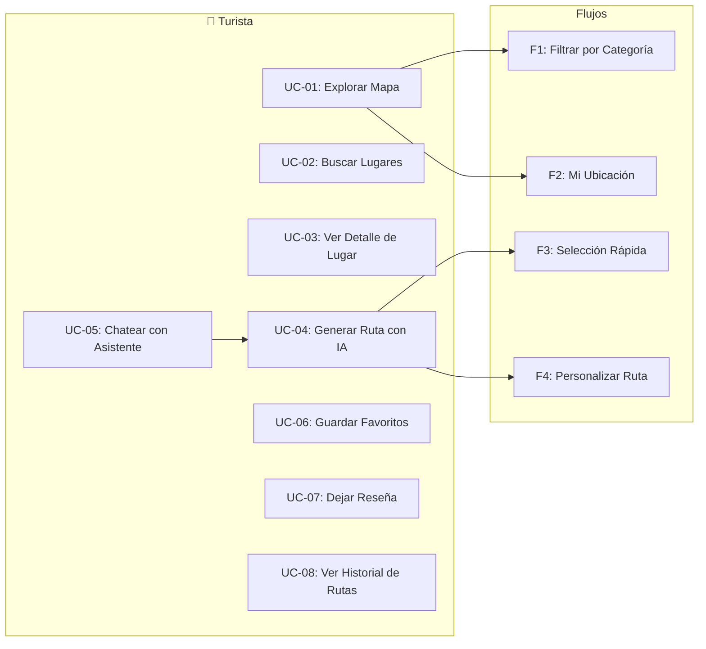
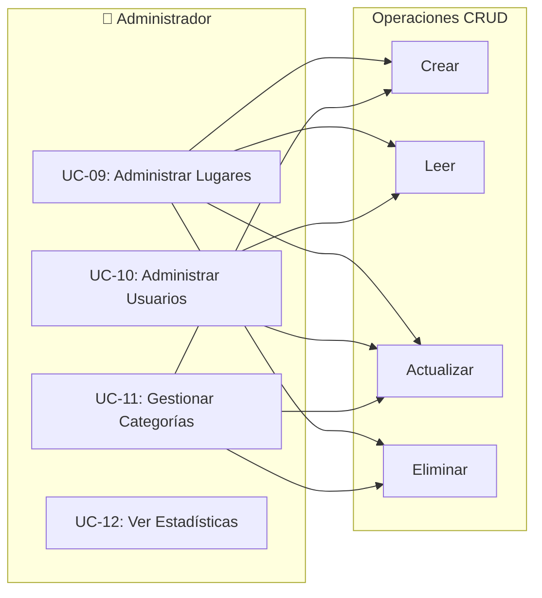
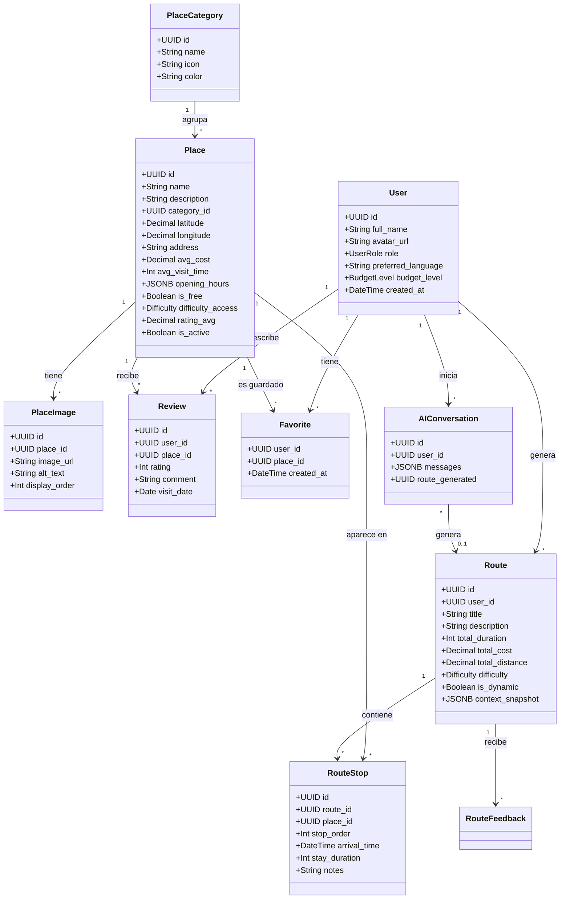

# 📐 Diagramas UML — Sistema de Turismo Sucre

## Diagrama de Casos de Uso General

```mermaid
graph TB
    subgraph Actores
        T((👤 Turista))
        A((🔑 Administrador))
        IA((🤖 Asistente IA))
    end

    subgraph "Sistema de Turismo Sucre"
        UC1[UC-01: Explorar Mapa]
        UC2[UC-02: Buscar Lugares]
        UC3[UC-03: Ver Detalle de Lugar]
        UC4[UC-04: Generar Ruta con IA]
        UC5[UC-05: Chatear con Asistente]
        UC6[UC-06: Guardar Favoritos]
        UC7[UC-07: Dejar Reseña]
        UC8[UC-08: Ver Historial de Rutas]
        UC9[UC-09: Administrar Lugares]
        UC10[UC-10: Administrar Usuarios]
        UC11[UC-11: Gestionar Categorías]
        UC12[UC-12: Ver Estadísticas]
    end

    %% Relaciones Turista
    T --> UC1
    T --> UC2
    T --> UC3
    T --> UC4
    T --> UC5
    T --> UC6
    T --> UC7
    T --> UC8

    %% Relaciones Admin
    A --> UC1
    A --> UC2
    A --> UC3
    A --> UC9
    A --> UC10
    A --> UC11
    A --> UC12

    %% Relaciones IA
    IA --> UC4
    IA --> UC5

    %% Include/Extend
    UC4 ..>|"<<include>>"| UC5
    UC4 ..>|"<<include>>"| UC1
    UC3 ..>|"<<extend>>"| UC6
    UC3 ..>|"<<extend>>"| UC7
```

---

## Diagrama de Casos de Uso — Turista



### Descripciones de Casos de Uso — Turista

| ID | Caso de Uso | Descripción | Precondición | Postcondición |
|----|------------|-------------|--------------|---------------|
| UC-01 | Explorar Mapa | El turista visualiza los lugares turísticos en un mapa interactivo de Sucre | Tiene acceso a la aplicación | Mapa cargado con marcadores |
| UC-02 | Buscar Lugares | El turista busca lugares por nombre o categoría | Está en la aplicación | Lista de lugares filtrados |
| UC-03 | Ver Detalle de Lugar | El turista ve información completa de un lugar (fotos, horarios, reseñas) | Ha seleccionado un lugar | Detalle del lugar mostrado |
| UC-04 | Generar Ruta con IA | La IA genera una ruta personalizada según tiempo, presupuesto y gustos | Turista autenticado | Ruta generada y mostrada en mapa |
| UC-05 | Chatear con Asistente | El turista interactúa con el chatbot para obtener recomendaciones | Turista autenticado | Respuestas personalizadas |
| UC-06 | Guardar Favoritos | El turista guarda un lugar en sus favoritos | Turista autenticado | Lugar guardado |
| UC-07 | Dejar Reseña | El turista califica y comenta un lugar visitado | Turista autenticado + visitó el lugar | Reseña publicada |
| UC-08 | Ver Historial de Rutas | El turista ve sus rutas generadas anteriormente | Turista autenticado | Lista de rutas |

---

## Diagrama de Casos de Uso — Administrador



### Descripciones de Casos de Uso — Administrador

| ID | Caso de Uso | Descripción | Precondición | Postcondición |
|----|------------|-------------|--------------|---------------|
| UC-09 | Administrar Lugares | CRUD completo de lugares turísticos (crear, editar, activar/desactivar) | Admin autenticado | Lugares actualizados |
| UC-10 | Administrar Usuarios | Ver usuarios, cambiar roles (tourist ↔ admin) | Admin autenticado | Roles actualizados |
| UC-11 | Gestionar Categorías | Crear, editar y eliminar categorías de lugares | Admin autenticado | Categorías actualizadas |
| UC-12 | Ver Estadísticas | Dashboard con métricas: lugares más visitados, rutas generadas, reseñas | Admin autenticado | Estadísticas mostradas |

---

## Diagrama de Clases


