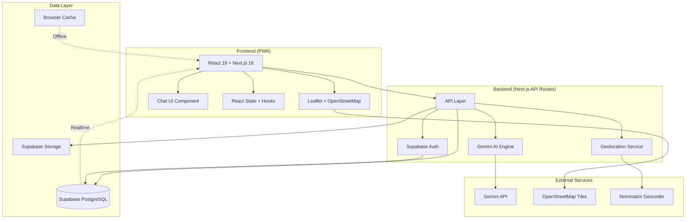
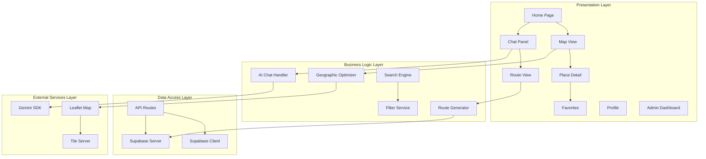
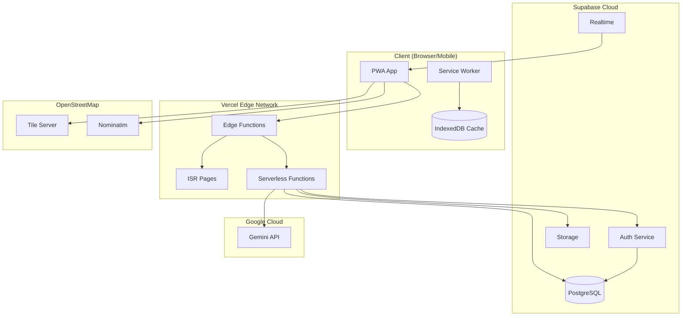
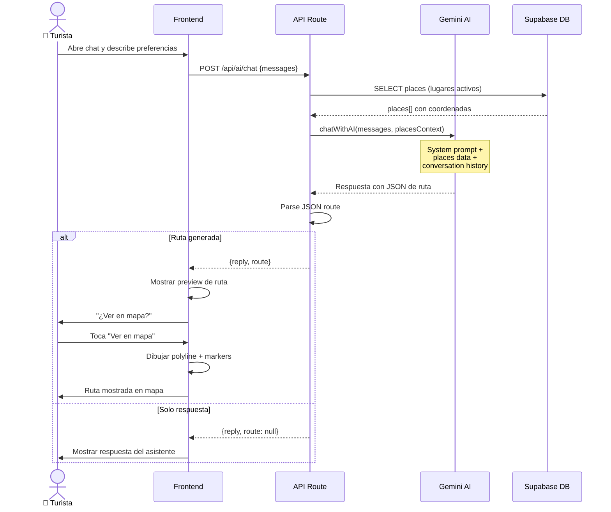
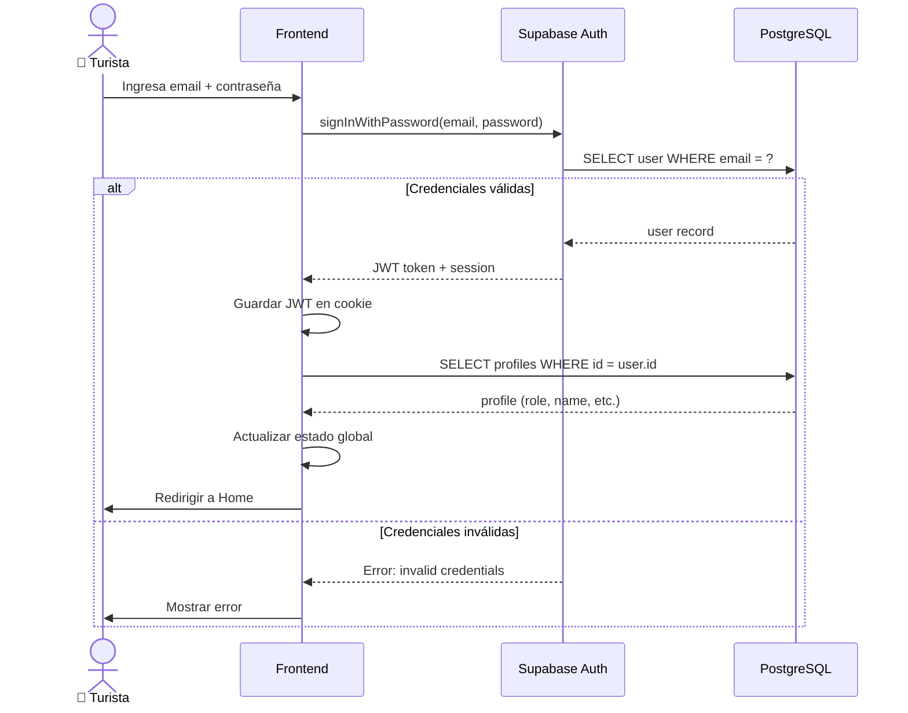
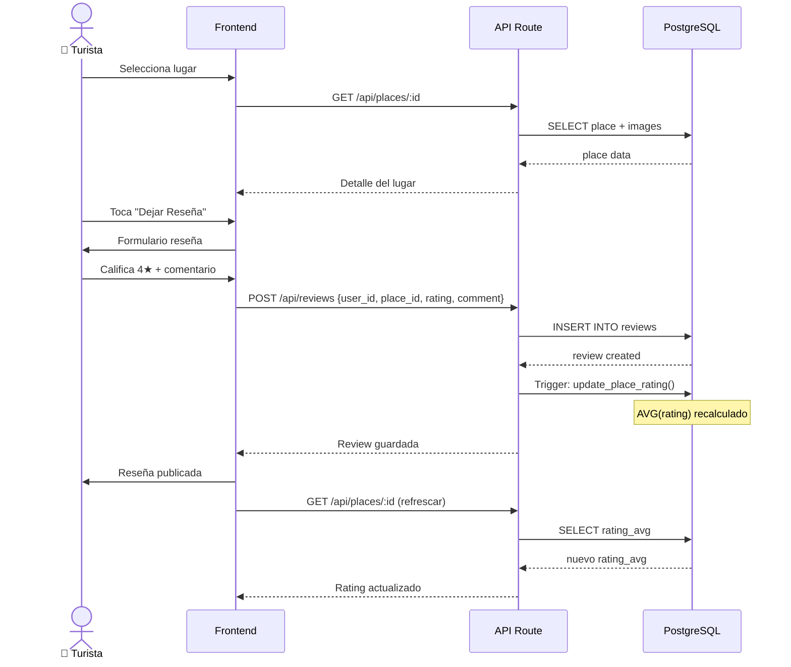

# 🏗️ Arquitectura del Sistema — Sucre Turismo

## Diagrama de Arquitectura de Alto Nivel

---

## Diagrama de Componentes

---

## Diagrama de Despliegue

---

## Diagrama de Secuencia: Generación de Ruta

---

## Diagrama de Secuencia: Autenticación

---

## Diagrama de Secuencia: Reseñas

