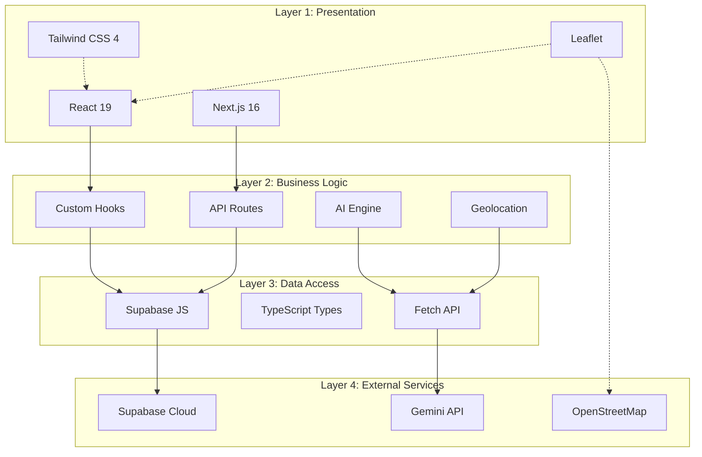
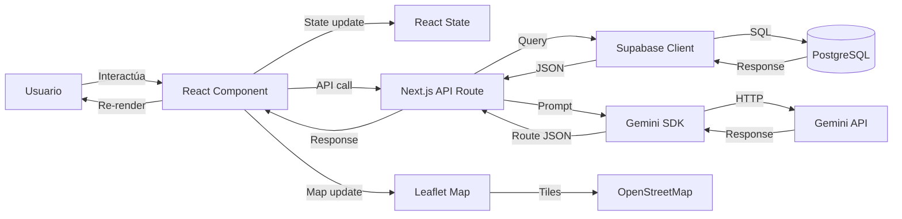

# 🛠️ Stack Tecnológico — Sucre Turismo

## Resumen del Stack

| Capa | Tecnología | Versión | Justificación |
|------|-----------|---------|---------------|
| **Frontend** | Next.js | 16.2.10 | SSR/SSG, API Routes, PWA support |
| **UI Library** | React | 19.2.4 | Ecosistema maduro, componentes reutilizables |
| **Language** | TypeScript | 5.x | Type safety, mejor DX, menos bugs |
| **Styling** | Tailwind CSS | 4.x | Utility-first, rápido de desarrollar |
| **Componentes UI** | CVA + clsx + tailwind-merge | — | Variantes de componentes, clases condicionales |
| **Iconos** | Lucide React | 1.23.0 | Iconos consistentes, ligeros |
| **Mapas** | Leaflet + react-leaflet | 1.9.4 / 5.0.0 | Open source, sin costo, OpenStreetMap |
| **Backend** | Next.js API Routes | — | Serverless functions, sin servidor separado |
| **Auth** | Supabase Auth | — | JWT, OAuth, magic links |
| **Database** | Supabase (PostgreSQL) | — | Relacional, RLS, real-time |
| **Storage** | Supabase Storage | — | Imágenes de lugares y avatares |
| **AI** | Gemini API | — | Generación de rutas, chat conversacional |
| **HTTP Client** | Fetch API nativo | — | Sin dependencias extra |
| **Package Manager** | pnpm | 10.33.0 | Rápido, eficiente con disco |
| **Runtime** | Node.js | 24.15.0 | LTS, soporte nativo |

---

## Diagrama de Capas



---

## Dependencias Principales

### Producción (`dependencies`)

```json
{
  "next": "16.2.10",
  "react": "19.2.4",
  "react-dom": "19.2.4",
  "leaflet": "1.9.4",
  "react-leaflet": "5.0.0",
  "@supabase/supabase-js": "^2.110.0",
  "@google/generative-ai": "^0.24.1",
  "class-variance-authority": "^0.7.1",
  "clsx": "^2.1.1",
  "tailwind-merge": "^3.6.0",
  "lucide-react": "^1.23.0"
}
```

### Desarrollo (`devDependencies`)

```json
{
  "@tailwindcss/postcss": "^4",
  "@types/leaflet": "^1.9.21",
  "@types/node": "^20",
  "@types/react": "^19",
  "@types/react-dom": "^19",
  "eslint": "^9",
  "eslint-config-next": "16.2.10",
  "tailwindcss": "^4",
  "typescript": "^5"
}
```

---

## Variables de Entorno

```bash
# Supabase
NEXT_PUBLIC_SUPABASE_URL=https://xxx.supabase.co    # URL del proyecto
NEXT_PUBLIC_SUPABASE_ANON_KEY=eyJ...                 # Key pública (client)
SUPABASE_URL=https://xxx.supabase.co                  # URL (server)
SUPABASE_SERVICE_ROLE_KEY=eyJ...                      # Key secreta (server)

# Gemini AI
GOOGLE_AI_API_KEY=AIza...                             # API key de Google AI Studio
```

---

## Decisiones de Arquitectura

### 1. Monolito con Serverless (no Microservicios)

**Decisión**: Next.js monolito con API Routes serverless.

**Por qué**:
- MVP con equipo pequeño (1 desarrollador)
- Supabase maneja BD + Auth + Storage (reduce complejidad)
- Vercel despliega serverless functions automáticamente
- Sin infraestructura que mantener

**Cuándo cambiar**: Si escala a >10K usuarios concurrentes, considerar separar el motor de IA en un servicio aparte.

### 2. PWA nativa (no app móvil separada)

**Decisión**: Progressive Web App con Next.js.

**Por qué**:
- Un solo código para web y móvil
- Funciona offline con Service Worker
- Instalable desde el navegador
- Sin costo de distribución (App Store/Play Store)

**Trade-off**: No tiene acceso completo a APIs nativas (cámara, GPS en background).

### 3. Leaflet + OSM (no Google Maps/Mapbox)

**Decisión**: Leaflet con OpenStreetMap.

**Por qué**:
- Costo cero (Google Maps cobra $200/mes after 28K loads)
- Open source, sin vendor lock-in
- Buenos tiles para Bolivia
- Comunidad activa

**Trade-off**: Menos features premium que Google Maps (3D, Street View).

### 4. Gemini (no OpenAI/Anthropic)

**Decisión**: Google Gemini API.

**Por qué**:
- Buenos precios ($0.075/1M input tokens para Flash)
- JSON mode nativo
- Context window grande (1M tokens)
- Sin necesidad de API key de OpenAI

**Trade-off**: Menos documentación community que OpenAI.

### 5. Supabase (no Firebase/Custom backend)

**Decisión**: Supabase como backend completo.

**Por qué**:
- PostgreSQL real (no NoSQL forzado)
- RLS (Row Level Security) incluido
- Real-time subscriptions
- Storage para imágenes
- Auto-generación de API desde schema
- Open source (self-hostable)

**Trade-off**: Menos ecosistema que Firebase para analytics.

---

## Flujo de Datos



---

## Seguridad

| Capa | Mecanismo | Detalle |
|------|-----------|---------|
| **Auth** | Supabase Auth | JWT tokens, bcrypt passwords |
| **API** | RLS Policies | Cada usuario solo ve sus datos |
| **Admin** | Role check | `profiles.role = 'admin'` en RLS |
| **API Keys** | Server-side only | service_role key solo en server |
| **CORS** | Supabase config | Dominios permitidos |
| **Rate Limiting** | Vercel | Built-in serverless limits |
| **XSS** | React | Escaping automático |
| **SQL Injection** | Supabase ORM | Parameterized queries |
